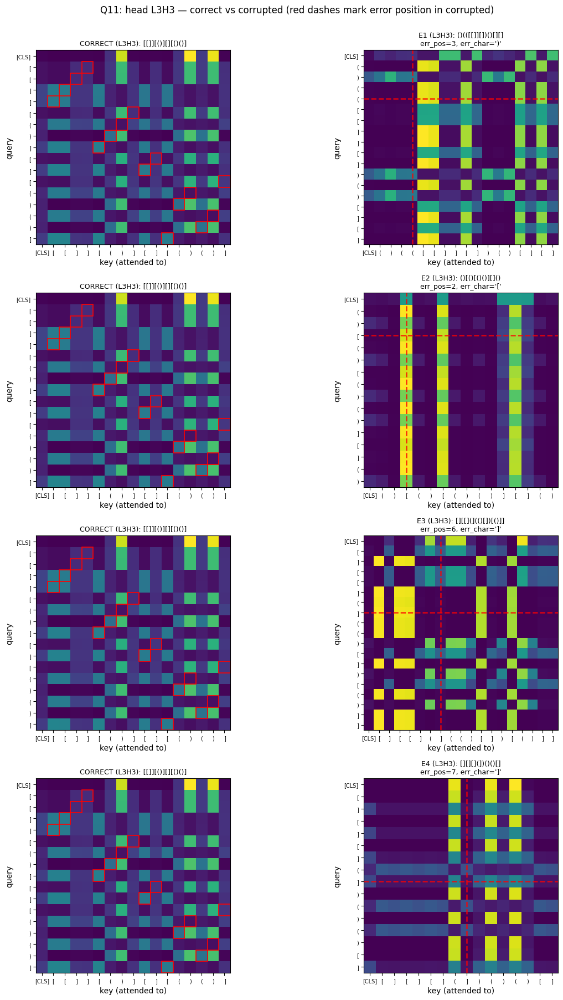
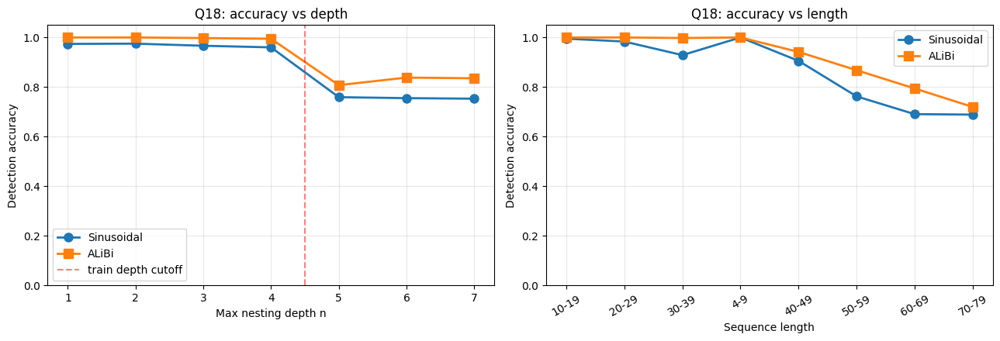
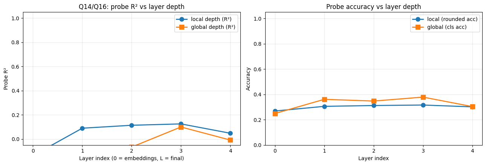

# Transformers and Dyck Languages

**Detection, Correction, and Interpretability of a Small Transformer Encoder Trained on D(2)**

> M1 Computational Linguistics, Université Paris Cité &middot; *Theory and Practice of Large Language Models* &middot; Lab 4 &middot; Prof. Guillaume Wisniewski &middot; May 2026

A small (≈795K-parameter) Transformer encoder trained from scratch on D(2), then probed to understand the mechanism it actually learns. The short version: the model reaches 97% in-distribution detection accuracy without implementing bracket matching.

---

## Headline findings

- **97.04% in-distribution detection (macro-F1 0.9561), but 14.8% of E4 (premature close) examples are missed.** Other error types (E1, E2, E3) are detected perfectly. The pattern rules out both a clean global-count rule and clean stack matching; it is most compatible with a local/positional approximation with a blind spot on stray closers.
- **OOD failure tracks length, not depth.** Accuracy on n=5/6/7 is essentially flat at ~75%; the breakdown by length is where the model collapses (above 50 tokens).
- **No bracket-matching attention head exists.** Across all 16 heads, the best matching score sits barely above the random-token baseline. What I find instead is aggregation hubs, parity oscillations, and a final-layer [CLS] register.
- **Weak progressive computation in the probe.** Local nesting depth is best linearly encoded at layer 3 (R² = 0.125), absent at the input embeddings (R² = −0.138), and partially discarded at the final layer (R² = +0.048).
- **ALiBi closes 4 percentage points of the OOD gap** and improves in-distribution accuracy too (97.04% → 99.86%; OOD 75.66% → 82.46%). Largest per-length gain: +10.6pp at length 50-59.

*Top error-attentive head (L3H3) on correct vs. corrupted strings. Red dashes mark the error position. E3 (type mismatch) saturates the attention grid; E4 (premature close) creates a clean vertical stripe at the error position; E1 and E2 produce dim, uniform maps with no localised signal. This is the qualitative basis for the per-error-type Δ analysis in §6.2 of the report.*

---

## What's in the repo

| File | Contents |
|------|----------|
| `LLMs_Lab_4.ipynb` | Main notebook: data generation, encoder, training, all 19 questions |
| `figures/` | Three key figures referenced in this README |
| `README.md` | This file |

---

## How to reproduce

Open `LLMs_Lab_4.ipynb` in Google Colab with a T4 GPU runtime and run all cells from top to bottom. Total wall-clock is about twelve minutes:

- Detection training: ~75 seconds (5 epochs)
- Correction training: ~225 seconds (15 epochs)
- ALiBi training: ~150 seconds
- Inference, attention analysis, and probing: ~5 minutes

All dependencies (PyTorch, scikit-learn, pandas, matplotlib) ship with the default Colab runtime; no `pip install` is required.

---

## Key results

| Question | Metric | Value |
|---|---|---|
| Q4 Detection (in-dist) | Accuracy / Macro-F1 | 0.9704 / 0.9561 |
| Q5 Correction (in-dist) | Token-acc / EM | 0.8702 / 0.2224 |
| Q7 Detection (OOD) | Accuracy / gap to in-dist | 0.7566 / +0.2138 |
| Q8 PDA baseline | Accuracy (both splits) | 1.0000 |
| Q9 Fine-tune (n=5, transfers to n=7) | Before → After | 0.7520 → 0.9970 |
| Q10 Best matching head | Matching score (above baseline) | ≈ 0 |
| Q11 Top error-attentive head | L3H3 Δ | +0.0474 |
| Q12 Attention rollout (overall) | Ratio err / non-err | 1.088× |
| Q13 Global depth probe | Ridge R² / logistic acc (chance 0.143) | −0.0088 / 0.3039 |
| Q14 Local depth probe | Best layer R² (layer 3) | 0.125 |
| Q15 Probe residual peaks | E3 ratio (strongest) | 1.626× |
| Q18 ALiBi | In-dist / OOD | 0.9986 / 0.8246 |

*ALiBi vs. sinusoidal positional encoding, broken down by nesting depth (left) and sequence length (right). The largest gains concentrate at the length ranges where the baseline fails most (+10.6pp at 50-59, +10.4pp at 60-69).*

---

## Interpretation, in one paragraph

The model does not implement bracket matching, does not linearly encode depth, and yet detects errors 97% of the time on the in-distribution split. The combination of (1) the systematic E4 miss pattern, (2) length-not-depth OOD failure, (3) compositional fine-tune transfer over length, (4) no matching heads + flat depth probe, and (5) ALiBi closing part of the OOD gap converges on a single reading: the encoder has learned a counting-plus-parity-plus-locality heuristic that approximates the Dyck rule well enough to handle most of the training distribution, without ever computing the matched-bracket relation that defines the language. This is the kind of approximation Bhattamishra et al. (2020) predict for fixed-width Transformers on D(k≥2).

*Per-layer probe R² for local (blue) and global (orange) nesting depth. The curve has the textbook progressive-computation shape (rising through layers 1-3, falling at layer 4), but the magnitude is small: peak local-depth R² is 0.125. The encoder builds something depth-related across layers, but what it computes is not primarily an explicit depth representation.*

---

## References

- Abnar, S. and Zuidema, W. (2020). *Quantifying attention flow in transformers.* ACL.
- Bhattamishra, S., Ahuja, K. and Goyal, N. (2020). *On the ability and limitations of transformers to recognise formal languages.* EMNLP.
- Press, O., Smith, N. A. and Lewis, M. (2022). *Train short, test long: attention with linear biases enables input length extrapolation.* ICLR.
- Vaswani, A. et al. (2017). *Attention is all you need.* NeurIPS.
- Yao, S., Peng, B., Papadimitriou, C. and Narasimhan, K. (2021). *Self-attention networks can process bounded hierarchical languages.* ACL-IJCNLP.

---

*Mohammad Ebrahim Sharifi &middot; M1 Computational Linguistics, Université Paris Cité*
